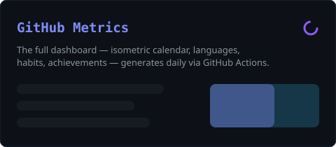

<div align="center">


<p>
  <a href="https://www.npmjs.com/~avzamelek"><b>npm</b></a> &nbsp;·&nbsp;
  <a href="https://github.com/avzamelek/hookproof"><b>hookproof</b></a> &nbsp;·&nbsp;
  <a href="https://hookprooflive.vercel.app"><b>live demo</b></a> &nbsp;·&nbsp;
  <a href="mailto:avztemeleqi@gmail.com"><b>email</b></a>
  &nbsp;&nbsp;
  
</p>

</div>

### 👋 Hi, I'm avzamelek

Building small, sharp developer tools — **zero-dependency, Web-standard, and edge-ready**. Currently shipping **[hookproof](https://github.com/avzamelek/hookproof)**: universal webhook signature verification through one uniform API.

<!-- TODO: your real name, location & socials go here — tell me and I'll fill them in -->

### 🚀 Featured — hookproof

> **Verify Stripe · GitHub · Slack · Shopify · Discord · Svix webhooks with one call.**
> Zero dependencies, Web Crypto only, timing-safe. Runs on Node, Bun, Deno, Cloudflare Workers & Vercel Edge.

```bash
npm install hookproof
```

**[⭐ Repo](https://github.com/avzamelek/hookproof)** &nbsp;·&nbsp; **[▶ Live playground](https://hookprooflive.vercel.app)** &nbsp;·&nbsp; **[📦 npm](https://www.npmjs.com/package/hookproof)**

### 🛠️ Tech


### 📈 Metrics

<!-- The dashboard below is generated by .github/workflows/metrics.yml and appears
     after the first Action run (see the setup note at the bottom). -->


### 🐍 Contribution snake

<picture>
  <source media="(prefers-color-scheme: dark)" srcset="https://raw.githubusercontent.com/avzamelek/avzamelek/output/github-snake-dark.svg" />
  
</picture>

### 🔥 Streak

<div align="center">

</div>

<div align="center"><sub>⚡ Zero deps by default · MIT by default</sub></div>

<!--
  ─────────────────────────────────────────────────────────────────────────────
  SETUP (one-time):
  1) Create a public repo named exactly "avzamelek" (GitHub shows a ✨ special note).
  2) For the Metrics dashboard: create a classic Personal Access Token
     (scopes: repo, read:org, read:user) and add it as a repo secret METRICS_TOKEN.
  3) Actions tab → run "Metrics" and "Snake" once (workflow_dispatch). Done.
  ─────────────────────────────────────────────────────────────────────────────
-->
